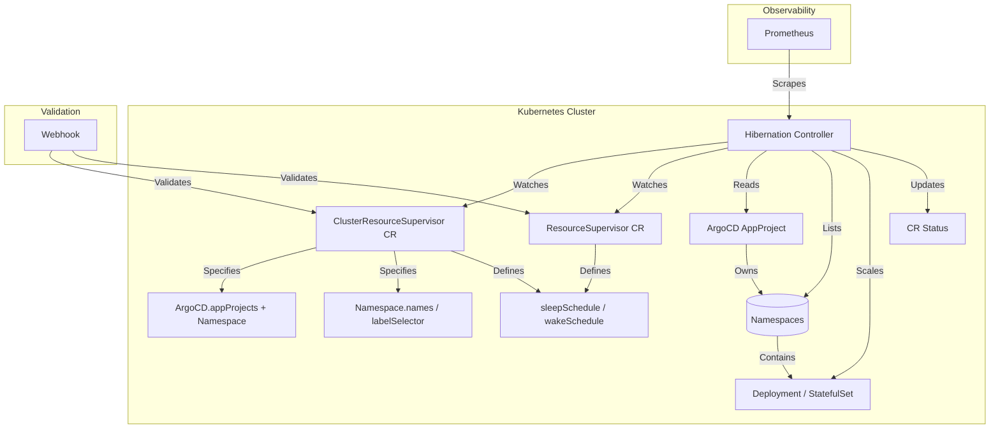

# Architecture

The **Hibernation Operator** is a lightweight yet powerful system designed to automate cost-saving hibernation of workloads in Kubernetes environments. It enables both platform teams and application owners to define schedules for scaling down and restoring applications during off-hours.

## Component Overview

The operator consists of a single intelligent controller that reconciles two custom resources, along with optional supporting components for validation and observability.

| Name | Type | Description |
|------|------|-------------|
| **Hibernation Controller** | Deployment | Reconciles both `ClusterResourceSupervisor` (cluster-scoped) and `ResourceSupervisor` (namespace-scoped) CRDs. Scales `Deployments` and `StatefulSets` to zero during sleep windows and restores original replica counts during wake windows. |
| **Webhook** | Deployment | Validates cron expressions and enforces required fields during CR creation/update via admission control. |
| **Metrics Endpoint** | Pod (sidecar or built-in) | Exposes Prometheus metrics (e.g., `hibernation_operator_sleeping_namespaces`, `hibernation_operator_reconcile_errors`). |
| **RBAC Resources** | ClusterRole, Role, Bindings | Grants minimal required permissions to list/watch namespaces, read ArgoCD `AppProject`s, and scale workloads. |

## Integration Capabilities

- **ArgoCD**: Resolves namespaces from specified `AppProject`s.
- **Kubernetes Native**: Works with standard `Deployment` and `StatefulSet` resources.
- **Prometheus**: Optional metrics for monitoring hibernation state.

---

## Architecture Diagram

The following diagram illustrates how the Hibernation Operator interacts with Kubernetes resources and external systems:

💡 **Diagram Legend**

> - **Solid arrows**: Active interactions (watch, read, scale, etc.)
> - **Dashed logic**: Configuration relationships (e.g., CR fields define behavior)
> - **CRs** are custom resources created by users
> - The controller **never modifies** namespaces or workloads unless explicitly targeted by a CR

---

## How It Works

1. **User creates a CR**:
   - Platform admin creates a `ClusterResourceSupervisor` to hibernate all `env=dev` namespaces.
   - Developer creates a `ResourceSupervisor` in their namespace for self-service hibernation.

1. **Controller reconciles**:
   - Discovers target namespaces (via names, labels, or ArgoCD AppProjects).
   - Records current replica counts of `Deployment`/`StatefulSet` in CR `status`.
   - Scales workloads to 0 at `sleepSchedule`.
   - Restores replicas at `wakeSchedule`.

1. **State is preserved**:
   - Even if the operator restarts, it uses the stored replica count in `status.sleepingNamespaces` to restore accurately.

1. **Observability**:
   - `currentStatus`, `nextReconcileTime`, and namespace lists are updated in real time.
   - Prometheus metrics enable alerting and dashboards.
