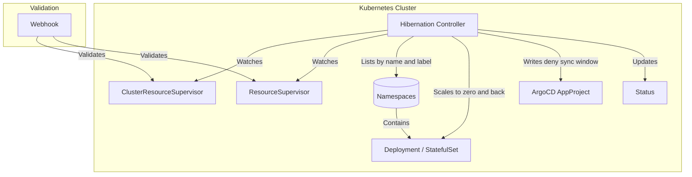

# Architecture

The Hibernation Operator scales `Deployments` and `StatefulSets` down to zero on a schedule and restores them afterwards, so environments that are only needed during working hours stop consuming compute the rest of the time. It reconciles two custom resources: [ResourceSupervisor](resource-supervisor.md), which a namespace owner creates to hibernate their own namespace, and [ClusterResourceSupervisor](cluster-resource-supervisor.md), which a platform team uses to cover a group of namespaces.

## Components

| Deployment | Description |
| --- | --- |
| `controller-manager` | Runs both reconcilers. Resolves target namespaces, scales workloads at the scheduled times, and maintains the status on each resource. |
| `webhook` | Serves the validating admission webhooks for both kinds. |

The metrics endpoint is provided by controller-runtime and is disabled by default. See [Metrics](../reference/metrics.md) for how to enable and scrape it.

## Reconcile flow

Both controllers follow the same shape on each reconcile:

1. Work out the next sleep and wake times from the cron expressions in `spec.schedule`.
1. Decide whether the workloads should currently be asleep or awake, and when to reconcile next.
1. Apply that state to the target workloads if they are not already in it.
1. Record the outcome in `status` and schedule the next check.

Because the decision is derived from the schedule and the current time on every pass rather than from a timer, a restarted operator picks up where it left off without missing a transition.

## Selecting namespaces

A `ResourceSupervisor` acts only on its own namespace and has nothing to select.

A `ClusterResourceSupervisor` builds its list from `spec.namespaces.names` and `spec.namespaces.labelSelector`, combining the two. Two filters then run, and anything they catch is reported in `status.ignoreNamespaces` instead of being hibernated:

- Namespaces annotated `hibernation.stakater.com/exclude: "true"`.
- The namespace the operator runs in.

## Preserving replica counts

The two resources record the pre-sleep replica count differently, which matters when reasoning about recovery.

| Resource | Where the count is stored |
| --- | --- |
| `ResourceSupervisor` | The `hibernation.stakater.com/original-replicas` annotation on each workload |
| `ClusterResourceSupervisor` | `status.sleepingNamespaces`, per namespace and workload |

Either way the count survives an operator restart. Workloads already at zero replicas are skipped rather than recorded.

## ArgoCD

ArgoCD treats a workload scaled to zero as drift from Git and will scale it back up, which would undo hibernation. The `spec.argocd` field on a `ClusterResourceSupervisor` handles this by writing a `deny` sync window onto the AppProjects it names, covering the sleep schedule and its duration.

!!! note
    This is the operator's only interaction with ArgoCD. It does not read `AppProject` destinations and does not use AppProjects to decide which namespaces to hibernate. Targets always come from `spec.namespaces`.

## Admission validation

The webhook rejects a resource before it is stored when:

- A cron expression in `spec.schedule` cannot be parsed.
- `sleepSchedule` and `wakeSchedule` are identical.
- A `ClusterResourceSupervisor` lists the same namespace twice, or claims a namespace already claimed by another `ClusterResourceSupervisor`.

An empty schedule is valid and means immediate, indefinite sleep. There is no check for a namespace being covered by both a `ClusterResourceSupervisor` and its own `ResourceSupervisor`, so that overlap has to be avoided by convention.
