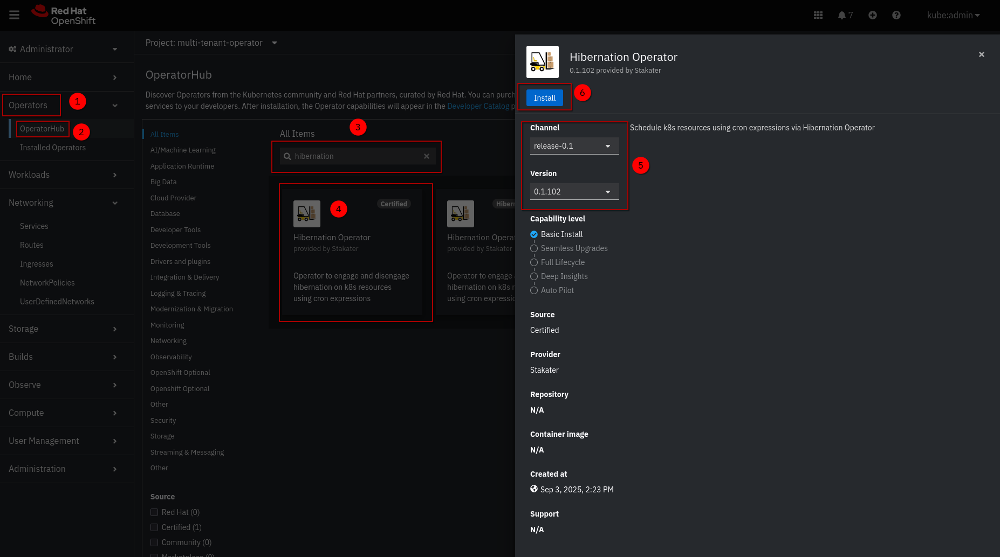

# On OpenShift

The **Hibernation Operator** is a [Red Hat Certified Operator](https://catalog.redhat.com/en/software/container-stacks/detail/687efb0f70dee945827cfe24) available on the **Red Hat Marketplace** and **OperatorHub** in OpenShift.

This document contains instructions for installing, configuring, and uninstalling the Hibernation Operator on OpenShift.

1. [OpenShift OperatorHub UI](#installing-via-operatorhub-ui)  
1. [CLI / GitOps](#installing-via-cli-or-gitops)  
1. [Uninstall](#uninstall-via-operatorhub-ui)

## Requirements

* An **OpenShift** cluster (v4.10 or higher recommended)

---

## Installing via OperatorHub UI

1. In the OpenShift Console, navigate to **Operators → OperatorHub** from the left sidebar.
1. Search for **`Hibernation Operator`** and click on the tile.
1. Click the **Install** button.

   

1. Configure the installation:
   * **Update channel**: `stable` (recommended for production)
   * **Installed Namespace**: Select **`hibernation-operator-system`** (create if it doesn’t exist)
   * **Update approval**:  
       * `Automatic` for development  
       * `Manual` for production (allows review of upgrades)

   Click **Install**.

   

1. Wait for the operator to install. You’ll see a status of **Installed operator: Ready for use** when ready.
1. Once installed, the Hibernation Operator is ready to manage hibernation policies across your cluster.

   

> 💡 **Note**: The operator is installed in the `hibernation-operator-system` namespace by default.

---

## Installing via CLI or GitOps

Use this method for automation, CI/CD pipelines, or GitOps workflows (e.g., with ArgoCD).

### Step 1: Create the Operator Namespace

```bash
oc create namespace hibernation-operator-system
```

### Step 2: Create an OperatorGroup

```bash
oc create -f - << EOF
apiVersion: operators.coreos.com/v1
kind: OperatorGroup
metadata:
  name: hibernation-operator
  namespace: hibernation-operator-system
spec:
  targetNamespaces:
  - hibernation-operator-system
EOF
```

### Step 3: Create a Subscription

```bash
oc create -f - << EOF
apiVersion: operators.coreos.com/v1alpha1
kind: Subscription
metadata:
  name: hibernation-operator
  namespace: hibernation-system
spec:
  channel: release-0.1
  installPlanApproval: Automatic
  name: hibernation-operator
  source: certified-operators
  sourceNamespace: openshift-marketplace
  # Optional: pin to a specific version
  # startingCSV: hibernation-operator.v0.1.102
EOF
```

> ✅ **GitOps Tip**: Commit these YAMLs to your GitOps repo to manage the operator declaratively.

### Step 4: Verify Installation

In the OpenShift Console:

* Go to **Operators → Installed Operators**
* Select the `hibernation-system` project
* Confirm the **Hibernation Operator** status is **Succeeded**

Or via CLI:

```bash
oc get csv -n hibernation-operator-system
oc get pods -n hibernation-operator-system
```

Wait until the `hibernation-controller` pod is `Running`.


---

## Uninstall via OperatorHub UI

> ⚠️ **Warning**: Uninstalling the operator **does not delete your CRs** (`ClusterResourceSupervisor`, `ResourceSupervisor`). Workloads may remain asleep if not cleaned up.

### Step 1: (Optional) Clean Up Hibernation Policies

Delete any active hibernation resources to restore workloads:

```bash
# Delete all cluster-wide hibernation rules
oc delete clusterresourcesupervisors.hibernation.stakater.com --all

# Delete all namespace-scoped hibernation rules
oc delete resourcesupervisors.hibernation.stakater.com --all --all-namespaces
```

### Step 2: Uninstall the Operator

1. In OpenShift Console, go to **Operators → Installed Operators**
1. Find **Hibernation Operator** in the `hibernation-operator-system` project
1. Click the **three-dot menu → Uninstall Operator**
1. Confirm removal

   

### Step 3: (Optional) Clean Up Leftover Resources

To fully remove all traces:

```bash
# Remove namespace (includes RBAC, deployments, etc.)
oc delete namespace hibernation-operator-system

# Remove CRDs (only if no other instances exist)
oc delete crd clusterresourcesupervisors.hibernation.stakater.com
oc delete crd resourcesupervisors.hibernation.stakater.com
```

> 🔒 **Note**: CRD deletion is irreversible. Ensure no other tools depend on them.

---

## Notes

* The Hibernation Operator **does not include a web console**—it is a lightweight, API-driven operator.
* It integrates natively with **OpenShift workloads** (`Deployments`, `StatefulSets`) and **ArgoCD** (if installed).
* For production, use **Manual approval** and test upgrades in a staging cluster first.
* Full CRD documentation:
    * [`ClusterResourceSupervisor`](../kubernetes-resources/cluster-resource-supervisor.md)
    * [`ResourceSupervisor`](../kubernetes-resources/resource-supervisor.md)
